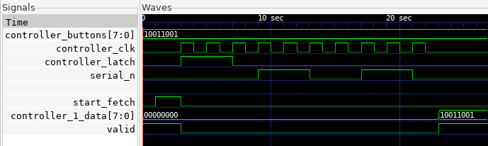

# NES Controller Interface

## About

* Written in Verilog-2005 using the [lowRISC Verilog Coding Style](https://github.com/lowRISC/style-guides/blob/master/VerilogCodingStyle.md)
* Synthesizable with Yosys, Vivado, and more
* Number of controllers is parameterizable
* Used by [UCSB IEEE Mapache 64](https://github.com/ucsbieee/mapache64) ( a custom 6502 video game console)

| Module                       | Icestorm               |
|------------------------------|------------------------|
| `nes_controller_interface#1` | 34 SB_LUT4 / 24 SB_DFF |
| `nes_controller_interface#4` | 36 SB_LUT4 / 69 SB_DFF |
|             `nes_controller` |  8 SB_LUT4 / 8 SB_DFF  |



## Notes

* Look at `"sim/controller_interface_tb.v"` for a reference on how to instantiate the module(s)
* NES Controllers allow being read up to 500 kHz. Go faster at your own risk
* You may have to increase the `LATCH_PULSE_WIDTH` parameter for higher frequencies
* The `nes_controller` module can be used for simulation

## Downloading

To download the RTL using `curl`:

```bash
curl -LJO https://raw.githubusercontent.com/sifferman/nes_controller_interface/main/rtl/rtl/nes_controller_interface.v
curl -LJO https://raw.githubusercontent.com/sifferman/nes_controller_interface/main/rtl/rtl/nes_controller.v
```

To add this repo as a FuseSoC library:

```bash
fusesoc library add nes_controller_interface https://github.com/sifferman/nes_controller_interface --sync-type=git
```

```yml
filesets:
  {fileset_name}:
    depend:
      - sifferman::nes_controller_interface
```

To make repository into a Git submodule:

```bash
git submodule add https://github.com/sifferman/nes_controller_interface <path/to/destination>
```

## Run In This Repository

```bash
# Init FuseSoC
fusesoc library add sifferman__nes_controller_interface . --sync-type=local
# Lint with Verilator
fusesoc run --target lint sifferman::nes_controller_interface
# Simulate with Icarus
fusesoc run --target sim --tool icarus sifferman::nes_controller_interface
# Simulate with Verilator
fusesoc run --target sim --tool verilator sifferman::nes_controller_interface
# Synthesize Controller Interface with Icestorm for the iCE40HX-8K CT256
fusesoc run --target synth_interface sifferman::nes_controller_interface
# Synthesize Controller with Icestorm for the iCE40HX-8K CT256
fusesoc run --target synth_controller sifferman::nes_controller_interface
```
